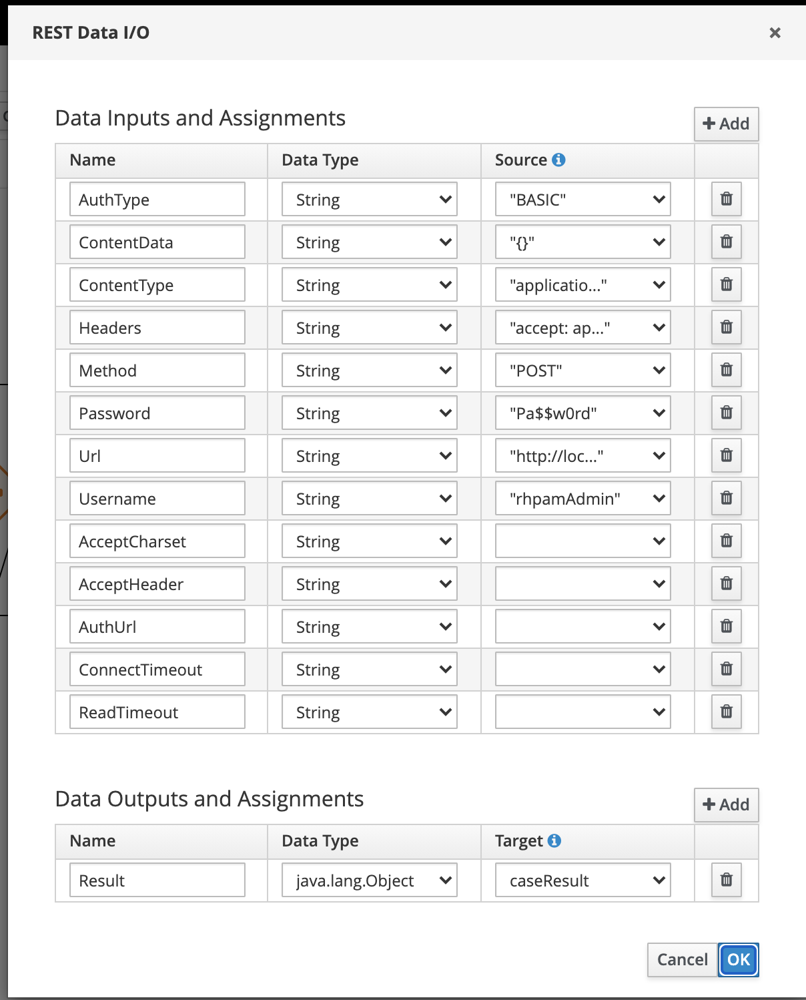

Case Instance from process and it's Life cycle
===============================================

This exmaple provides inforamtion about, how to create a case instance from the process. In this example to make a process to start case we need to create a custom workitem handler that invoke the kie-server api and start the case.

The described example has 2 kjars (One for [process project](https://github.com/rmuppane/process-to-case-example.git) and another for [case project](https://github.com/rmuppane/case-project-example.git)) case that have PER_CASE runtime strategy and process that need different runtime strategy.

We can use org.jbpm.process.workitem.rest.RESTWorkItemHandler to start a case instance from process using REST call.

RESTWorkItemHandler supports the following set of input parameters to properly configure the REST call and start the case.

Test this example by deploying both kJars. Start the [process](/src/main/resources/com/myspace/process_to_case/process.bpmn) instance and observe the no os process instances created and no of tasks available to claim. 
